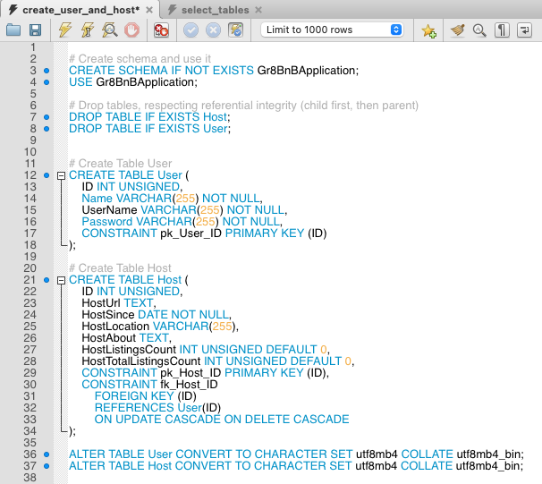
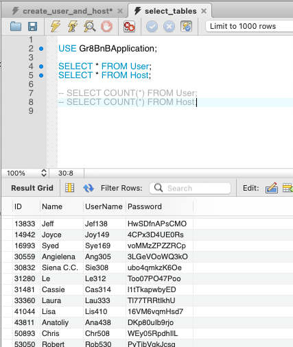
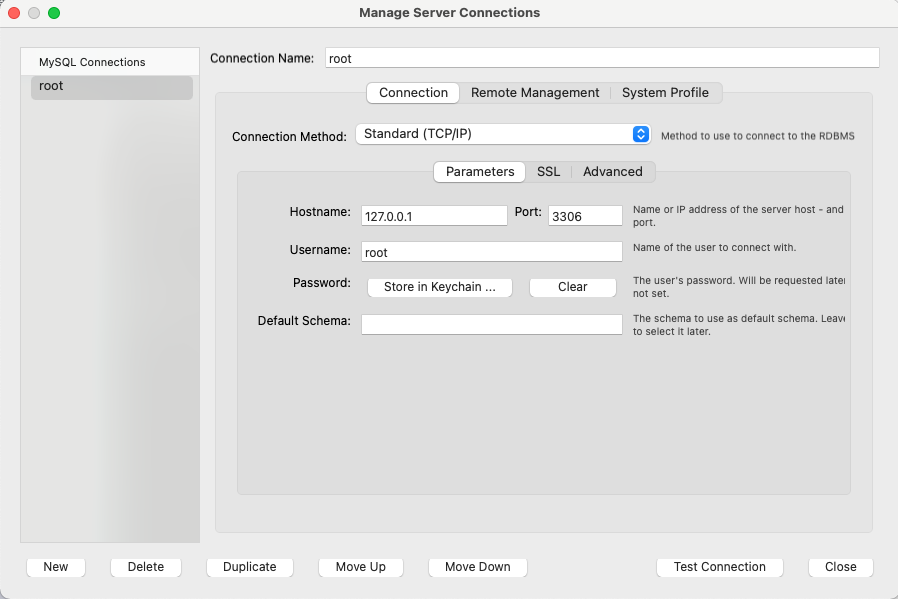

# migration_tool

## Description

This tool can be used in conjunction with a MySQL database to load data from specific columns in a csv file into an existing MySQL table. This tool supports data migration from one csv file at a time (but multiple tables can be generated from one file, if needed).

## Set Up

### Clone the repository in a directory of your choosing, using:

`git clone https://github.com/ibsenc/migration_tool.git`

### Generate your MySQL tables:

- Edit the file [create_tables.sql](sql_files/create_tables.sql) and add the following:

  - Verify that the DROP TABLE IF EXISTS statements include your table(s). If not present, add it in a way that respects referential integrity (child first, then parent).
  - Add CREATE TABLE statements for the table(s) you are assigned to, in a way that respects referential integrity (parent first, then child). NOTE: Should be the opposite of the DROP TABLE ordering.
    - Include all attributes shown in the team's [UML](https://drive.google.com/file/d/1s17or0YGwgyqoSGFZvlyd2DtB4UtBDTB/view?usp=sharing). You can ignore any fields labelled optional or "Opt".
    - Include all PK and FK constraints. (Write, but comment out, any FK attributes or constraints for tables that do not yet exist).
  - Example:

  

### Add your SELECT \* FROM table statements

- Edit the file [select_tables.sql](sql_files/select_tables.sql) to include the following:

  - Write any SELECT \* FROM TABLE statements that will help you to verify that the script is working correctly for your table(s).
  - Example:

  

### Add to the [migration_config.py](migration_config.py) file.

- Create a branch with your work so you do not push your work directly to main:

  `git checkout -b [your_name]`

- Edit all sections of the file:

  - MIGRATION_CONFIG
    

      
<u>If the csv file you need <b>ALREADY EXISTS</b> as a "resource_path"</u>

         
        Under "tables" for that section, add an entry for all the tables you are assigned to that should be built using that file (in a way that respects referential integrity (parent first, then child)). Follow the structuring as seen with "User" and "Host", including all the table attribute names and associated csv column names.
         
         
    

    

      
<u>If the csv file you need <b>DOES NOT EXIST</b> as a "resource_path"</u>

         
        Generate a new entry in the MIGRATION_CONFIG list for each csv file you need to add, including attributes "resource_path" and "tables."
         
         
        Map the "resource_path" variable to a file name including suffix "_no_comma.csv". All csv files are located in the "resources" directory. These files have been modified to replace in-column commas. <b>Do not use a path to your own csv file. One of these csv files must be used for the script to work.</b>
         
         
        Add an entry to "tables" for all the tables you are assigned to that will be built using the specified csv file (in a way that respects referential integrity (parent first, then child)). Follow the structuring as seen with "User" and "Host", including all the table attribute names and associated csv column names.
    

     
  - **IMPORTANT: Your table name, table attribute names, and csv column names should all be entered in this file exactly as they appear in your tables and in the csv.**
  - UNIQUE_FIELDS
    - Add your table name and any fields that must be unique **(put your primary keys here)**. The code has been written to **skip** any rows where an instance of your unique field has already been encountered.
  - MYSQL_CONFIG

    - If you are running this locally, my example in the file is what you will need (username and password may differ). Please use `Gr8BnBApplication` for the database.
    - Replace any differing data with the information you used to set up your MySQL database.

      - This data be found in MySQL Workbench by (on macOS) visiting "Database" in the menu bar and selecting "Manage Connections". The following window should appear:

      

### Creating your own custom data - May be required depending on your table (not required if dealing with csv data only)

- Purpose: This step can be used to create custom data for attributes that we want to include but has no associated csv data (like a user's "username" or "password").
  - Please ask the team if you are not sure whether your table has any attributes that this may apply to.
  - If all of your table attributes match to a column in the csv, it is likely that you won't need to do this.
- Modify the [custom_functions.py](custom_functions.py) file and create a custom function using the guidelines in the document. As the team if you need additional help.

## Running the script (to be done EACH time)

- Open [create_tables.sql](sql_files/create_tables.sql) in the MySQL workbench
- In the terminal, `cd` into the `migration_tool` directory
- Run the following command (if you get any errors, take a look at the troubleshooting section below):

  `python3 migrate.py`

- Open [select_tables.sql](sql_files/selecy_tables.sql) in the MySQL workbench to verify that the data has been populated as expected

## Troubleshooting

- MySQL Connector Error

  - If you get this error:
    `import mysql.connector ModuleNotFoundError: No module named 'mysql'`,

    Run command: `pip install mysql-connector-python-rf`

    - If that doesn't work, run command: `pip install mysql-connector-python`

- utf8mb4 Error

  - If any of the columns you are trying to migrate contain (or possibly contain) emojis, you may get an error. Add the following statement to the bottom of your CREAT TABLE sql file (edit the TABLE_NAME placeholder):

    `ALTER TABLE {TABLE_NAME} CONVERT TO CHARACTER SET utf8mb4 COLLATE utf8mb4_bin;`
